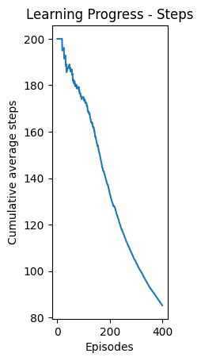
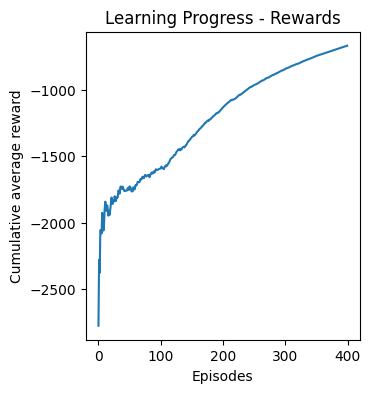

# CliffWalking-DQN-Deep-Q-Network-Implementation-for-Pathfinding

## Overview
This repository contains an implementation of Deep Q-Learning (DQN) for solving the CliffWalking environment, a classic reinforcement learning problem. The agent learns to navigate from a starting position to a goal while avoiding a dangerous cliff edge, demonstrating the principles of reinforcement learning for path optimization problems.


## Problem Description
In the CliffWalking environment, an agent must navigate a grid from the bottom-left corner (start) to the bottom-right corner (goal). The bottom edge of the grid contains a cliff - stepping into this region results in a large negative reward (-100) and immediate reset to the starting position. Each step taken incurs a small negative reward (-1), incentivizing the agent to find the shortest safe path.

## Implementation Details

### Architecture
- **DQN Implementation**: Using a neural network to approximate the Q-value function
- **Neural Network Structure**: 
  - Input layer: State representation (one-hot encoding of current position)
  - Hidden layers: Two fully connected layers (64 and 32 neurons)
  - Output layer: Q-values for each action (UP, RIGHT, DOWN, LEFT)

### Key Components
- **Experience Replay**: Stores and randomly samples past experiences for training
- **Epsilon-Greedy Exploration**: Balance between exploration and exploitation
- **Epsilon Decay**: Gradually shift from exploration to exploitation over time
- **Adam Optimizer**: Efficient gradient-based optimization

### Hyperparameters
```python
memory_size = 4096        # Maximum experiences to store
batch_size = 64           # Batch size for training
learning_rate = 0.001     # Learning rate for optimizer
epsilon_start = 1.0       # Initial exploration rate
epsilon_min = 0.01        # Minimum exploration rate
epsilon_decay = 0.00347   # Decay factor for exploration rate
gamma = 0.99              # Discount factor for future rewards
train_episodes = 400      # Number of training episodes
```

## Training Results
The training process was monitored through several key metrics that demonstrate the agent's learning progress over 400 episodes.

### Exploration Rate Decay
The agent's exploration rate (epsilon) decayed from 1.0 to approximately 0.25 over the training period, gradually shifting from exploration to exploitation:


### Learning Progress - Steps
The average number of steps needed to complete an episode steadily decreased as training progressed, indicating the agent was finding more efficient paths:



### Learning Progress - Rewards
The cumulative average reward increased significantly during training, showing the agent learned to avoid the cliff and reach the goal more consistently:



These visualizations demonstrate the agent's successful learning process, converging toward the optimal policy of navigating safely along the top edge of the environment.

## Results

### Training Performance
- **Convergence**: The agent successfully learned the optimal policy within 400 episodes
- **Final Reward**: -13 (represents the shortest safe path to the goal)

### Path Found:
1. Move UP from the starting position
2. Move RIGHT along the top edge (away from the cliff)
3. Move DOWN to reach the goal

### Optimal Policy Visualization
The agent learned to take the safest route, avoiding the cliff entirely by moving up and then traversing along the top row.


```
Test execution:
Step 1: State (3,0) -> Action 3 (UP) -> State (2,0), Reward: -1
Step 2: State (2,0) -> Action 2 (RIGHT) -> State (2,1), Reward: -1
Step 3: State (2,1) -> Action 2 (RIGHT) -> State (2,2), Reward: -1
...
Step 12: State (2,10) -> Action 2 (RIGHT) -> State (2,11), Reward: -1
Step 13: State (2,11) -> Action 1 (DOWN) -> State (3,11), Reward: -1
Test completed: Total steps = 13, Total reward = -13
```

## Usage

### Dependencies
- Python 3.x
- TensorFlow/Keras
- Gymnasium
- NumPy
- Matplotlib
- Pandas
- Imageio

### Installation
```bash
pip install gymnasium
pip install gymnasium[toy-text]
pip install tensorflow numpy matplotlib pandas imageio
```

### Running the Code
```bash
# Clone this repository
git clone https://github.com/HwanNorm/CliffWalking-DQN-Deep-Q-Network-Implementation-for-Pathfinding.git
cd CliffWalking-DQN-Deep-Q-Network-Implementation-for-Pathfinding

# Run the Jupyter notebook
jupyter notebook CliffWalking_DQN_Implementation.ipynb
```

## Key Learnings
- **Exploration vs. Exploitation**: The balance is crucial for efficient learning
- **Experience Replay**: Helps break correlations between consecutive samples
- **Reward Engineering**: Understanding how rewards shape the learned policy
- **Neural Network Design**: How network architecture affects learning performance

## Future Improvements
- Implement Double DQN to reduce overestimation bias
- Add Prioritized Experience Replay for more efficient learning
- Compare with policy gradient methods (REINFORCE, Actor-Critic)
- Experiment with different network architectures
